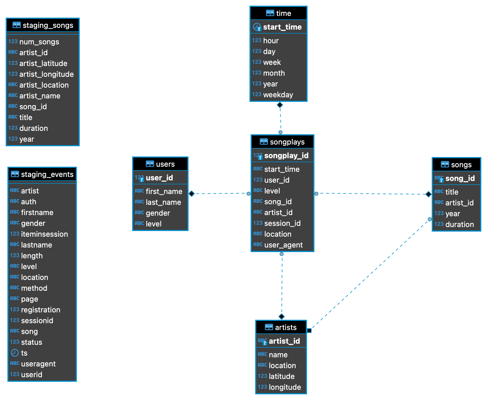

# Udacity Data Engineer Course / Project 3: Data Warehouse
## 1 Description
The data from Sparkify resides in S3, in a directory of JSON logs on user activity on the app, as well as a directory with JSON metadata on the songs in their app. 
The data needs to be staged in redshift and transformed into a set of dimensional tables for the analytics team to continue finding insights in what songs the users are listening to. 
To reach this goal an ETL process needs to be in place, to extract, stage and transform the data from the json files into a redshift database.
The database is using the star schema and contains the following fact and dimension tables:  
Fact tables:
- songplays

Dimension tables:
- users
- artist
- song
- time

## 2 Project Setup
### 2.1 Prerequisites
The following tools/packages/frameworks have to be installed on your system
- python3 with psycopg2 and boto3

### 2.2 Create aws infrastructure
1. copy ```aws.example.cfg``` and rename it to ```aws.cfg``` and add your aws key and secret.
1. copy ```config.example.cfg``` and rename it to ```config.cfg```
2. run ```python3 iac/create_aws_infrastructure.py``` to create the aws infrastructure (iam role, redshift cluster). The script will end, when the cluster is completly created and active. This may take a while.
3. Security group "IP-Whitelisting":
- log in into aws
- choose your region 
- go to redshift
- click on your cluster
- click on ```Properties``` tab
- in the ```Network and security settings``` section click on the associated vpc security group
- Add your current IP to the inbound rules of the security group for redshift db port (default: 5439) and save it (For security reasons the associated security group will block all access by default, therefore "ip white-listing" is needed)

### 2.3 Run the project
1. run ```python3 create_tables.py``` to create the sharkifydb and all the tables needed
2. run ```python3 etl.py``` to copy data from s3 to the staging tables and run queries to fill the fact and dimension tables. This may take a while.

## 3 ER-Diagram
